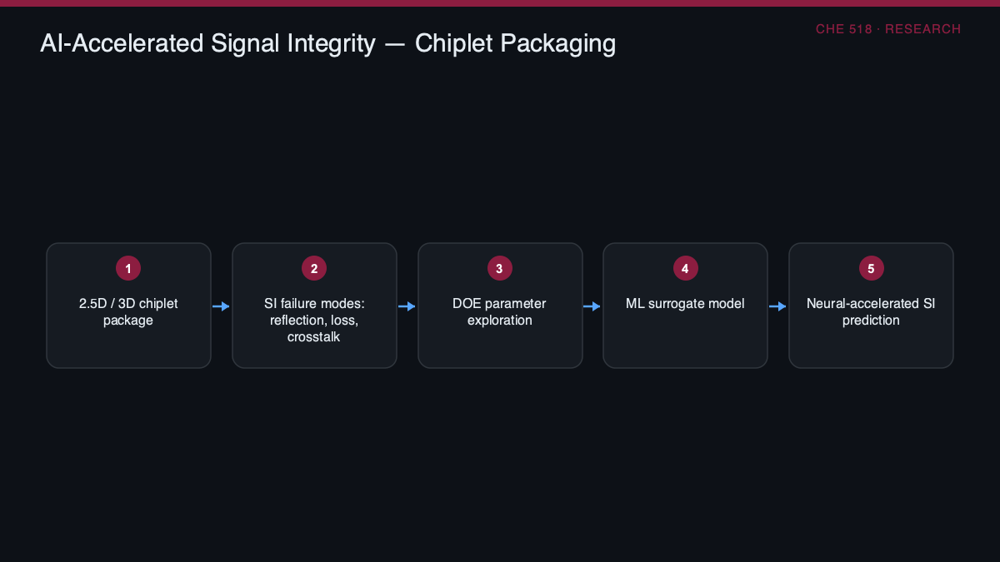

# Semiconductor Packaging Research

> Research proposal: using AI to accelerate signal integrity in chiplet packaging

     



### 🌐 Live project page → **https://selsaady1.github.io/semiconductor-packaging-research/**

## Overview
A graduate research proposal (ASU CHE 518, the course instructor) titled 'AI Accelerated Signal Integrity in Chiplet-Based Semiconductor Packaging.' It addresses the growing difficulty of maintaining signal integrity across die-to-die interconnects in heterogeneous 2.5D/3D chiplet packages, where reflections, loss, crosstalk, and material transitions threaten performance. The work proposes integrating AI-driven workflows into the package-level co-design loop to reduce signal integrity violation risk, shorten design turnaround, and improve yield.

## Key Achievements
- Authored a structured ~15-slide research proposal with a ~90-word abstract framing AI-accelerated signal integrity (SI) for 2.5D/3D chiplet packaging
- Proposed an AI-driven SI workflow combining machine-learning surrogate modeling, design-of-experiments (DOE) parameter exploration, and neural-accelerated simulation as an alternative to full EM simulation
- Identified concrete SI failure mechanisms in chiplet packages (reflections, loss, crosstalk, interposer/TSV effects) and mapped DOE variables across geometry, interconnect pitch, and materials
- Wrote detailed peer-review responses defending the approach, proposing federated learning, physics-based synthetic data, and a UCIe-standardized AI training dataset format to overcome SI data scarcity across multi-vendor chiplet ecosystems
- Grounded the proposal in current industry sources (SemiEngineering, Keysight application notes, UCIe Consortium, Open Compute Project)

## Approach
The project is a literature-based research proposal and presentation rather than an implemented system. It surveys chiplet architectures, 2.5D/3D packaging, and SI fundamentals, then lays out a proposed AI-in-the-loop co-design pipeline: ML-based SI metric prediction, DOE-driven parameter-space exploration, and surrogate models trained on EM simulation data to replace slow full-wave simulation. A hypothetical chiplet interconnect channel is used as the case-study vehicle, and the peer-question responses extend the method to 3D-IC/HBM stacking, SiP, process control, and automated visual inspection.

## Tools & Technologies
- Microsoft Word (report deliverables)
- Machine learning / neural surrogate modeling (proposed)
- Design of Experiments (DOE)
- Electromagnetic (EM) simulation (referenced)
- UCIe / chiplet packaging domain references

## Repository Structure
```
.gitignore
.nojekyll
LICENSE
README.md
docs/Elsaady_Research_Project_Abstract_Outline.docx
docs/Elsaady_Synopsis.docx
images/diagram.png
images/diagram.svg
index.html
```

## Results
No measured results: the proposal explicitly frames speedup, accuracy, yield improvement, and SI margin gains as anticipated outcomes. The deliverables are two Word documents — the abstract/outline and the peer-response synopsis — in docs/.

## Deliverable
See [`docs/Elsaady_Research_Project_Abstract_Outline.docx`](docs/Elsaady_Research_Project_Abstract_Outline.docx).

## License
MIT — see [`LICENSE`](LICENSE).

---
_Part of [Saif Elsaady's engineering portfolio](https://selsaady1.github.io/portfolio/). Deliverables only — routine homework/quizzes/exams excluded._